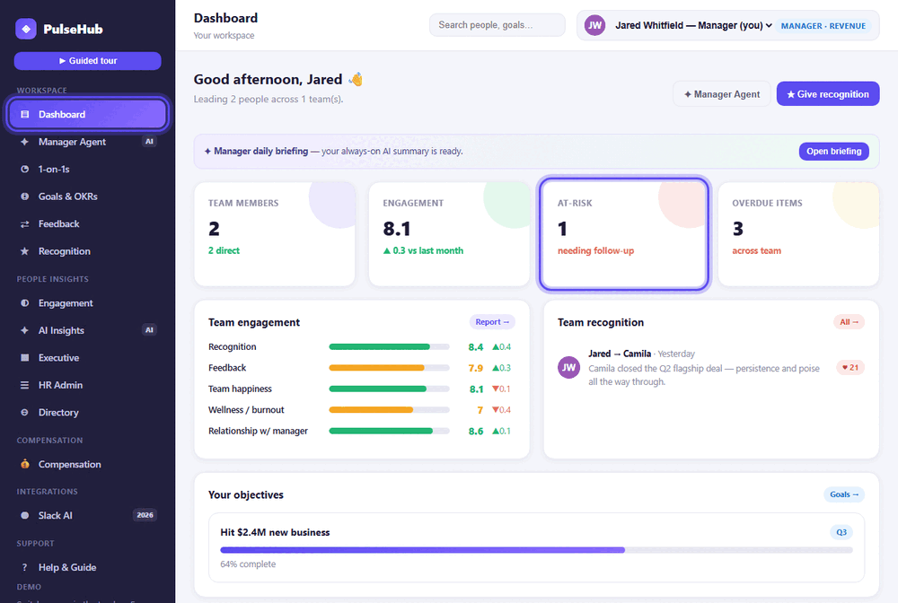
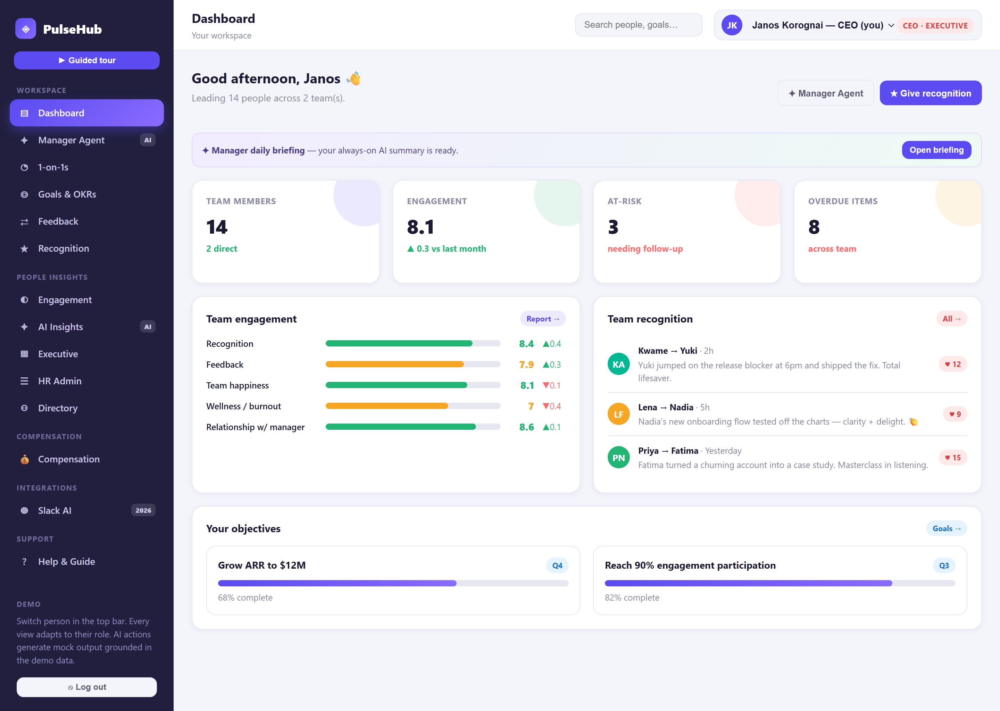
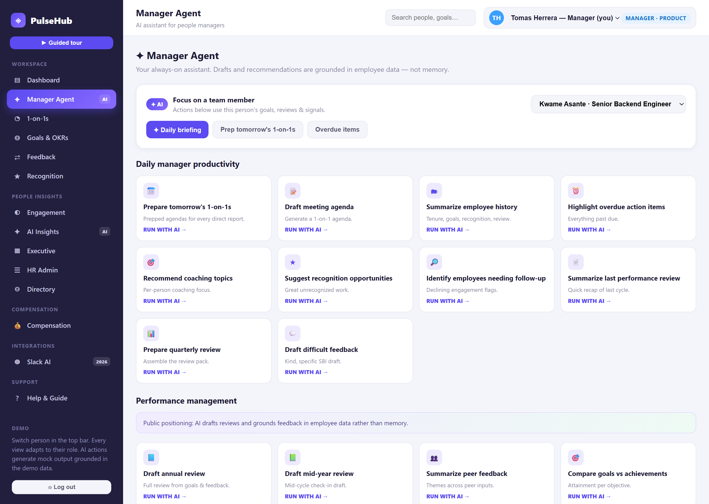
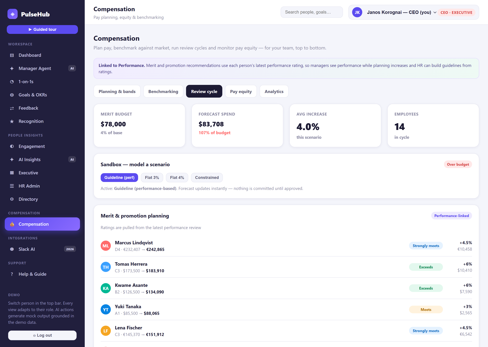
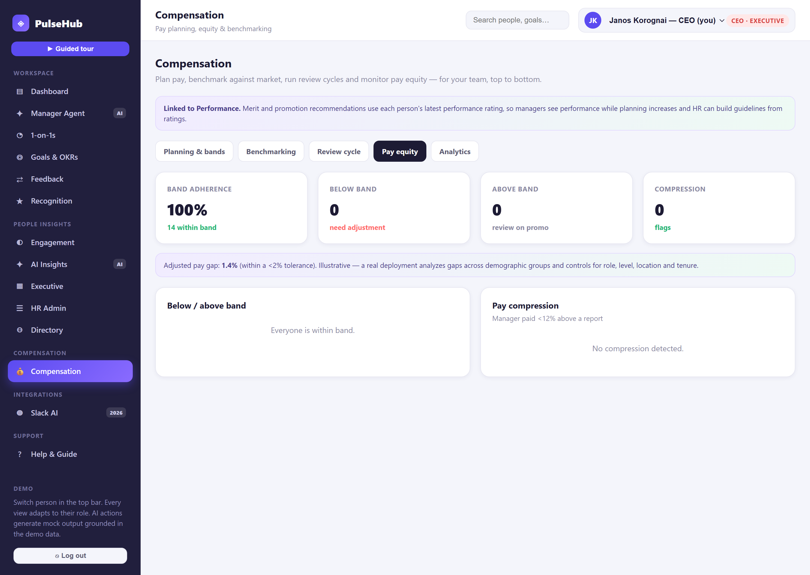
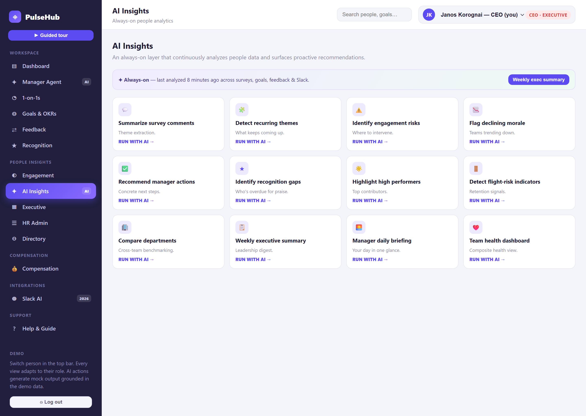
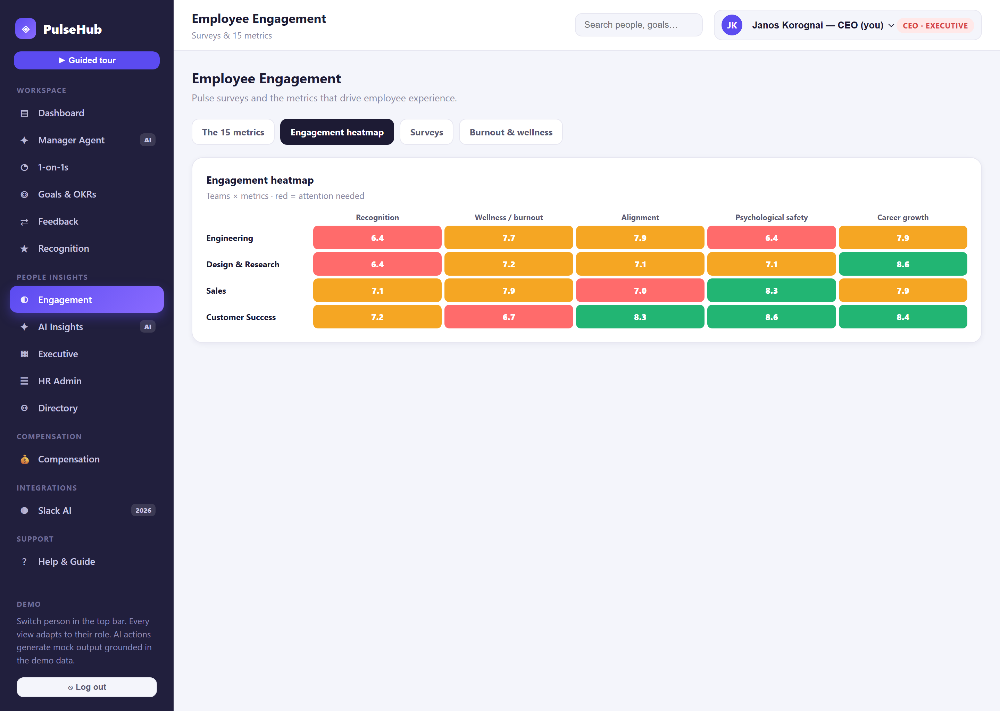
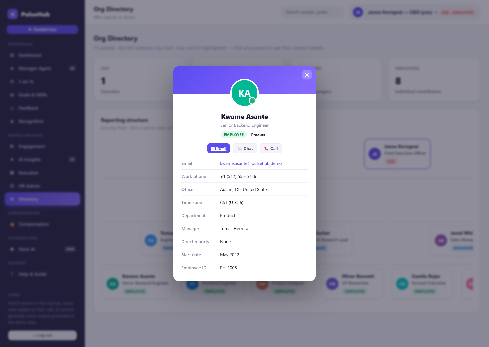
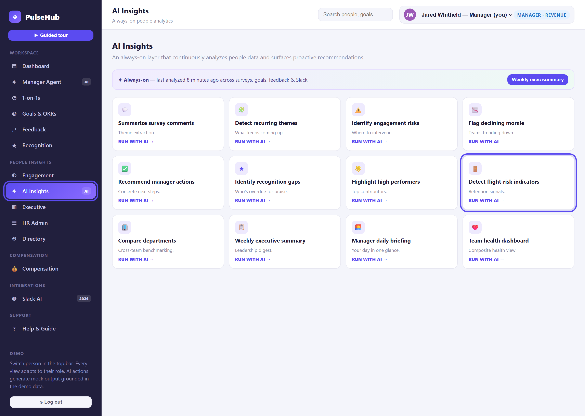

# PulseHub — Employee Experience Platform (Interactive Demo)

<p align="center">
  <a href="http://pulsehub.korognai.net"></a>
  <br>
  <em><a href="http://pulsehub.korognai.net">▶ Try the live demo</a> · or open <code>index.html</code> locally</em>
</p>

A self-contained, single-file demo of a modern **agentic HR platform** — engagement surveys, recognition, goals & OKRs, performance and 1-on-1s, an AI **Manager Agent**, an always-on people-insights layer, and a full **compensation** module — all tied together by a role-based permission model that mirrors a real reporting hierarchy.

It runs entirely in your browser from one HTML file. **No install, no build, no server, no internet required.**

> ⚠️ **This is an illustrative demo.** It was built independently from publicly-described product concepts to showcase demo craft, product understanding and agentic-AI fluency. It is **not** affiliated with, endorsed by, or connected to any company, and contains **no** proprietary code, data, or confidential information. Every person, metric, benchmark and AI output is **fictional**.

---

## ✨ Highlights

- **Single file, zero dependencies** — pure HTML/CSS/vanilla JS. Open `index.html` and it works, even offline.
- **Role-aware** — sign in as any of 15 people; the entire app adapts to their role and scope (self / team / division / company).
- **Agentic Manager Agent** — AI that *drafts* reviews, 1-on-1 prep, coaching and feedback, grounded in employee data rather than memory.
- **Performance ↔ Compensation link** — review ratings flow into merit planning, with a live budget **sandbox** and pay-equity checks.
- **Guided demo tours** — four presenter-ready, self-running stories that navigate the app and **highlight the relevant UI** as they narrate.
- **Live, reactive KPIs** — posting recognition lifts the engagement score; resolving a flight risk drops the at-risk count.
- **Explain-everything tooltips** — hover any metric for its meaning, **scale**, and how it's measured.

---

## 🚀 Quick start

**Live demo:** **[pulsehub.korognai.net](http://pulsehub.korognai.net)** — nothing to install.

Or run it locally:

```text
1. Download / clone this repo.
2. Double-click index.html  (opens in any modern browser).
3. On the login screen, click "Sign in" to enter as the CEO,
   or pick any of the 15 demo accounts to experience that role.
```

No package manager, no `npm install`, no toolchain. It's just an HTML file.

**Try the tours first:** click **▶ Guided tour** on the login screen (or in the sidebar) and pick a story.

---

## 🧭 Guided tours

Four selectable, self-running narratives with step-by-step UI highlighting:

| Tour | Theme | The story in one line |
|------|-------|-----------------------|
| **Save a flight risk** | Retention | Catch disengagement early → coach → recognize → engagement rises. |
| **Review a top performer in minutes** | Performance | The Manager Agent drafts an evidence-based review, not from memory. |
| **Run a fair merit cycle** | Compensation | Bands → Mercer benchmark → sandbox scenarios → pay equity. |
| **Listen and lift eNPS** | Engagement | Measure with eNPS → understand with AI → act → the needle moves. |

---

## 🧩 Feature modules

| Area | What it does |
|------|--------------|
| **Dashboard** | Role-aware home. Clickable KPIs drill into the exact underlying lists. |
| **Manager Agent** *(managers+)* | 20 AI actions across daily productivity and performance management. |
| **1-on-1s** | Agendas, recaps, outstanding actions, coaching, AI summaries. |
| **Goals & OKRs** | Individual → team → company objectives with progress and alignment. |
| **Feedback** | Continuous feedback, coaching notes, anonymous feedback, trends. |
| **Recognition** | "Good Vibes" shout-outs, tags, feed, and leaderboard. |
| **Engagement** *(managers+)* | eNPS + 15 metrics, heatmap, surveys, burnout monitor. |
| **AI Insights** *(managers+)* | 12 always-on insights: themes, risks, flight risk, exec summary. |
| **Executive** *(managers+)* | Org health, attrition, performance distribution, manager effectiveness. |
| **HR Admin** *(managers+)* | Survey/review-cycle setup, calibration, compliance, adoption. |
| **Compensation** *(managers+)* | Bands, benchmarking, review-cycle sandbox, pay equity, analytics. |
| **Org Directory** *(everyone)* | Full company chart; click a person for an Outlook-style contact card. |
| **Slack AI** *(demo)* | Summaries, blockers, review evidence, HR-policy Q&A. |
| **Help & Guide** *(everyone)* | Personalized, always-current in-app help. |

---

## 🔐 Roles & permissions

Every screen and every number is scoped to who you are and who reports to you.

| Capability | Employee | Manager | VP | CEO |
|------------|:---:|:---:|:---:|:---:|
| Dashboard, 1-on-1s, Goals, Feedback, Recognition | ✅ | ✅ | ✅ | ✅ |
| Answer pulse surveys · view org chart | ✅ | ✅ | ✅ | ✅ |
| Manager Agent (AI) | — | ✅ | ✅ | ✅ |
| Engagement · AI Insights · Executive · HR Admin · Compensation | — | Team | Division | Company |
| Switch into other people (demo) | Any | Any | Any | Any |

*"Team / Division / Company" indicates the scope of the data shown. The org chart is visible to everyone; management surfaces are visible to people leaders and scoped to their reporting line.*

---

## 🏢 The demo organization

15 fictional people: **1 CEO → 2 VPs → 4 managers → 8 individual contributors**, across a Product and a Revenue division. Signing in as different people is the fastest way to feel how the product re-shapes itself around each role.

---

## 🛠️ Tech notes

- **Stack:** one `index.html` (~135 KB) — vanilla JavaScript, hand-rolled CSS, no frameworks, no external requests.
- **State:** in-memory only; changes (recognition, pulses, comp scenarios) reset on reload.
- **Compatibility:** any modern browser (Chrome, Edge, Firefox, Safari); works fully offline.

---

## 📦 What's in this repo

| File | Description |
|------|-------------|
| `index.html` | The complete interactive demo. |
| `docs/` | Screenshots and the guided-tour GIF used in this README. |
| `PulseHub-User-Guide.pdf` | Detailed, long-form product guide (every screen + a glossary). |
| `Sales-Onepagers.pdf` | Value-narrative + discovery→demo map one-pagers. |
| `About-This-Build.pdf` | One-page cover note tying the pack together. |
| `LICENSE` | MIT license. |
| `.gitignore` | Standard ignores. |
| `README.md` | This file. |

---

## 📸 Screenshots

Captured from the running demo — every view is deep-linkable (see below), so the shots stay in sync with the app.

|  |  |
|--|--|
| **Dashboard** (CEO) | **Manager Agent** |
|  |  |
| **Compensation sandbox** | **Pay equity** |
|  |  |
| **AI Insights** | **Engagement heatmap** |
|  |  |
| **Org directory + contact card** | **Guided tour (with UI highlight)** |
|  |  |

### Deep links (bonus)

The app supports URL-hash deep links, handy for demos and shareable views:

```text
index.html#user=1&view=dashboard
index.html#user=1&view=comp&tab=reviews
index.html#user=1&view=directory&contact=8
index.html#tour=0&step=1
```

Parameters: `user` (1–15), `view`, `tab` (comp / engagement tab name), `contact` (person id), `tour` (0–3) + `step`.

---

## ⚖️ Disclaimer & license

This project is an **independent, illustrative demonstration**. All names, organizations, metrics, market benchmarks and AI-generated text are **fictional and for demonstration only**. It is not affiliated with or endorsed by any company and contains no proprietary or confidential material.

Released under the **MIT License** (see [`LICENSE`](LICENSE)) — use it freely as a reference or starting point.
